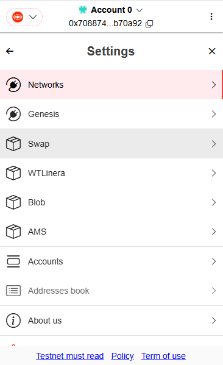
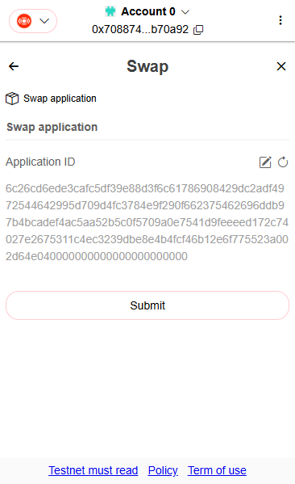
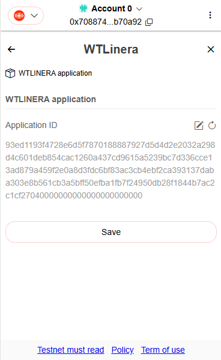
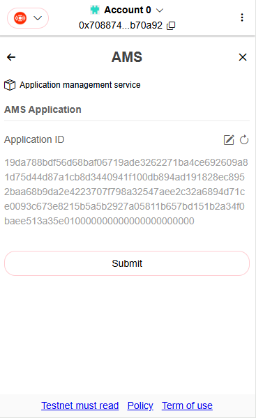
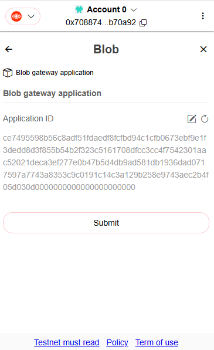
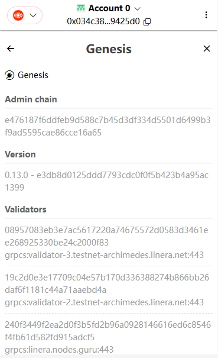

# Check initial settings

### Swap application id

<kbd>
  
</kbd>
<kbd>
  
</kbd>

TBD

### WLinera application id

<kbd>
  
</kbd>

TBD

**Note**: Linera don't support to transfer native tokens to application currently. So we use WLinera application to play as native application wrapper here. It'll be removed soon after application native assets is supported.

### AMS application id

<kbd>
  
</kbd>

TBD

### Blob gateway application id

<kbd>
  
</kbd>

TBD

### Faucet

<kbd>
  
</kbd>

TBD

### Validate network information

<kbd>
  
</kbd>

TBD
