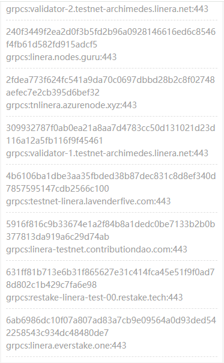

# Check initial settings

### Swap application id

Swap application spec is provided by Linera Hacker community. Here we just integrate it for easy access. Users can deploy their own Swap application and then change the application ID to the one they deployed.

<kbd>
  
</kbd>
<kbd>
  
</kbd>

### WLinera application id

WLinera application spec is provided by the Linera Hacker community. Here, we just integrate it for easy access. WTLinera application just exists to let users be able to exchange ERC20-like tokens with wrapper native tokens due to native tokens cannot support the application holder. It'll be removed after the application holder is supported.

<kbd>
  
</kbd>

### AMS application id

Application management service could be integrated with other applications to let them register themselves to application management service. Application management service provides a frontend application to show the applications' information. It acts like an application store of the Linera network.

<kbd>
  
</kbd>

### Blob gateway application id

Blob gateway is the blob data indexer of the Linera blockchain. ResPeer provides a frontend to list base information of uploaded blob date. With blob gateway, you can also fetch blob data with **GET** method, which is different from graphql **POST**. It's better for applications that need to use the blob as an image in the front end with html ** tag. Users or applications who need their data to be displayed by the blob gateway should register the blob metadata to the blob gateway by themselves.

<kbd>
  
</kbd>

### Faucet

It's genesis faucet. Users may run their own faucet service, but they should have the same network information as the genesis one.

<kbd>
  
</kbd>

### Validate network information

Users should check the **Genesis** menu to validate they connect to the network with the right *Admin chain*, *Validators set* and *version*.

<kbd>
  
</kbd>
<kbd>
  
</kbd>

