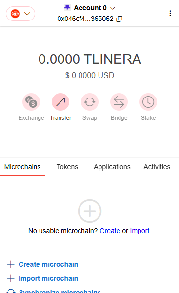
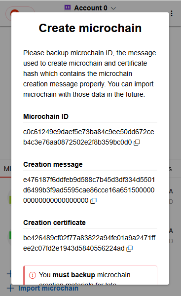
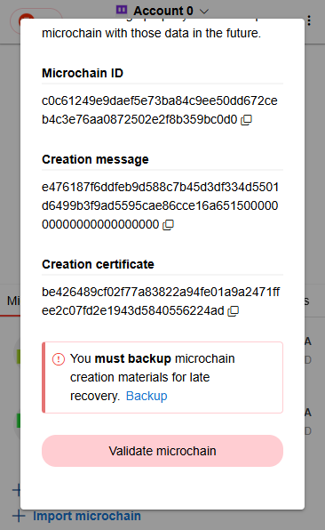
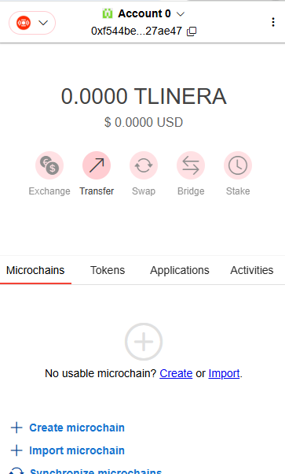
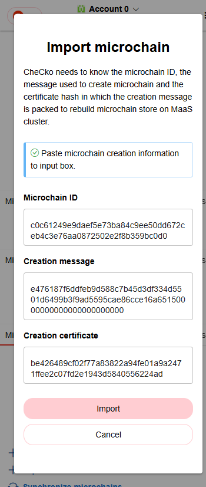

# Claim microchain

Each microchain will be claimed from preset faucet with users' public key.

### Claim microchain

<kbd>
  
</kbd>

TBD

**Note**: After claiming microchain, swap application, ams application, wlinera application and blob gateway application will be requested to created chain automatically. This may be removed later after we can call any application on any chain.

### Validate microchain

<kbd>
  
</kbd>

TBD

### Backup microchain

<kbd>
  
</kbd>

TBD

**Note**: User must backup microchain creation material properly. It could be used to recover the created microchain on another RPC endpoint again later. Keep in mind that in Linera, microchain is everything of your assets.

### Import microchain

<kbd>
  
</kbd>

<kbd>
  
</kbd>

TBD
