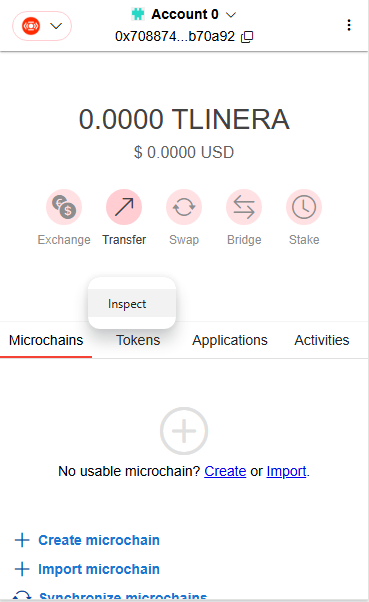
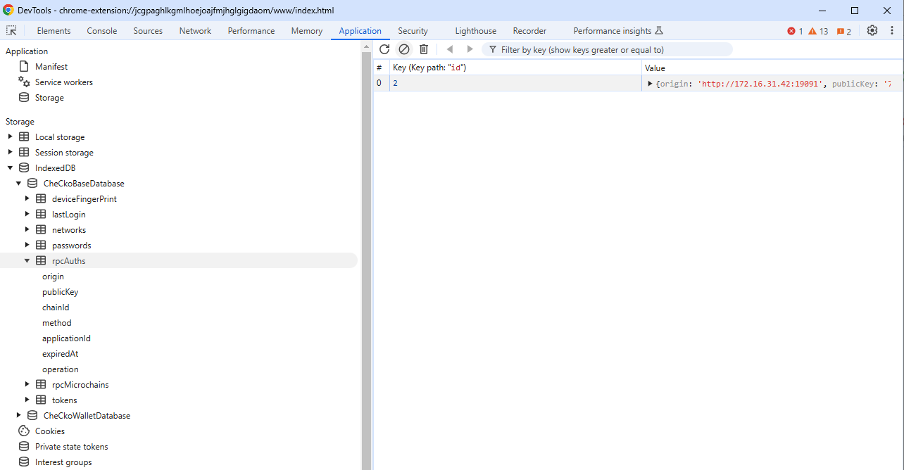
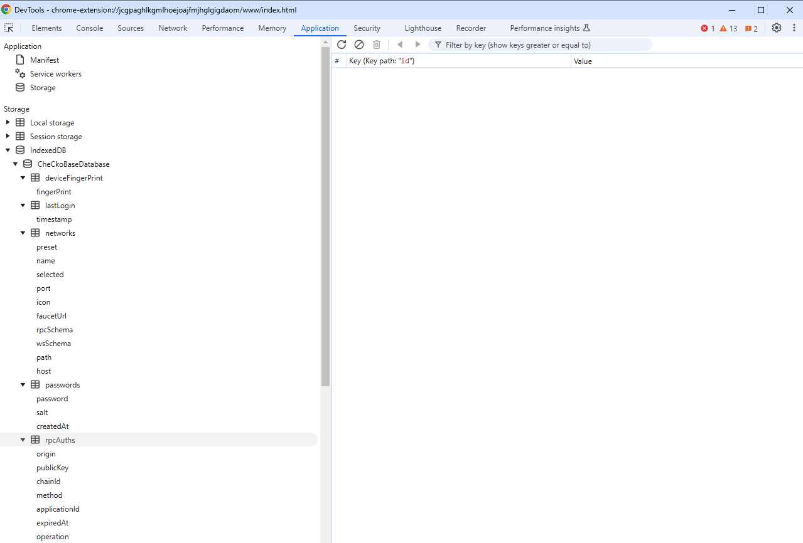

# Clear current application connection

We should have a permissions menu in CheCko to let user be able to remove connection from web application, but currently it's not implemented. If users really want to remove it, they can follow this sections to remove what they want. And, keep in mind that always backup your important data before you do that. It's dangerous to operate wallet store directly.

### Open wallet database storage

<kbd>
  
</kbd>

TBD

### Find what you want to remove

<kbd>
  
</kbd>

TBD

### Remove

<kbd>
  
</kbd>

TBD
