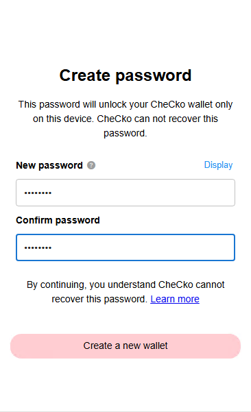
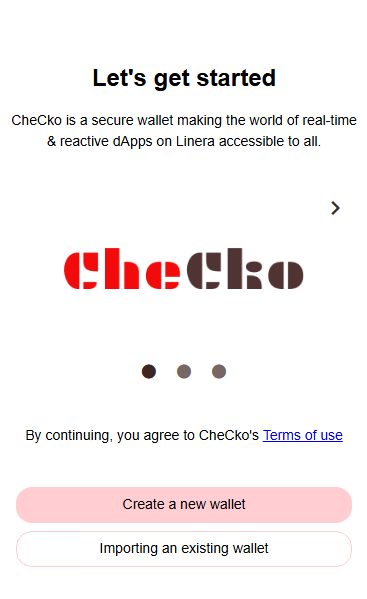
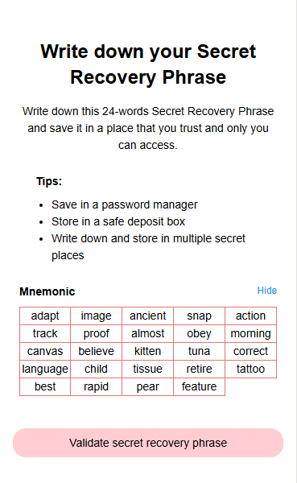
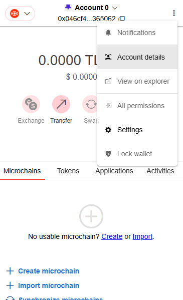
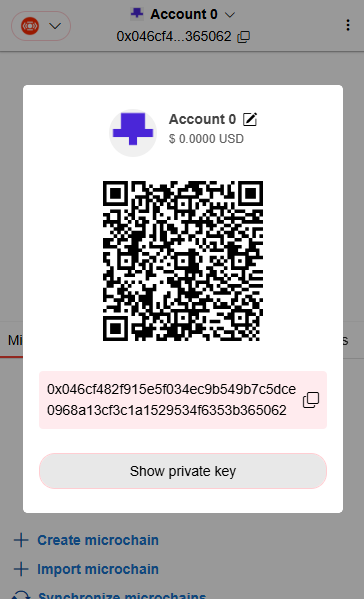
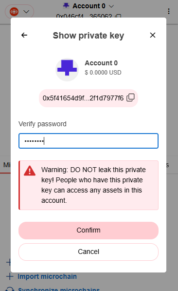
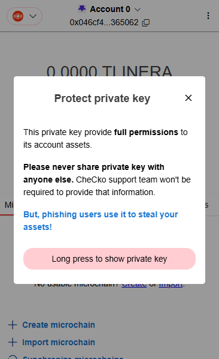
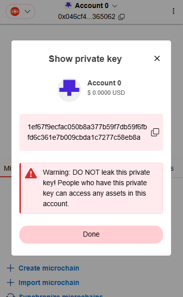

# Create account

After installation, CheCko will be run in chrome extension environment. But if you don't have any account created or you just install it, it'll open a new tab in chrome as a tutorial of account creation.

### Create password

<kbd>
  
</kbd>

TBD

### Create account

<kbd>
  
</kbd>

TBD

**Note**: Currently the mnemonic can only recover the first generated account. If you create new account in the wallet again, you cannot recover it with this mnemonic currently.

### Backup mnemonic

<kbd>
  
</kbd>

TBD

### Backup private key

 
<kbd>
  
</kbd>
<kbd>
  
</kbd>
<kbd>
  
</kbd>
<kbd>
  
</kbd>
<kbd>
  
</kbd>

TBD

**Note**: You must backup your mnemonic properly out of CheCko (may be write it down with a piece of paper). CheCko cannot recover your mnemonic if you lose it.

### Validate mnemonic

TBD
