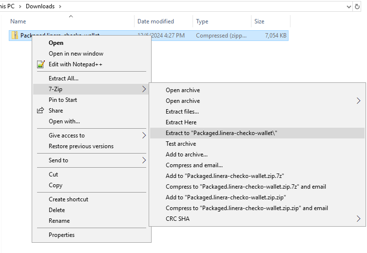
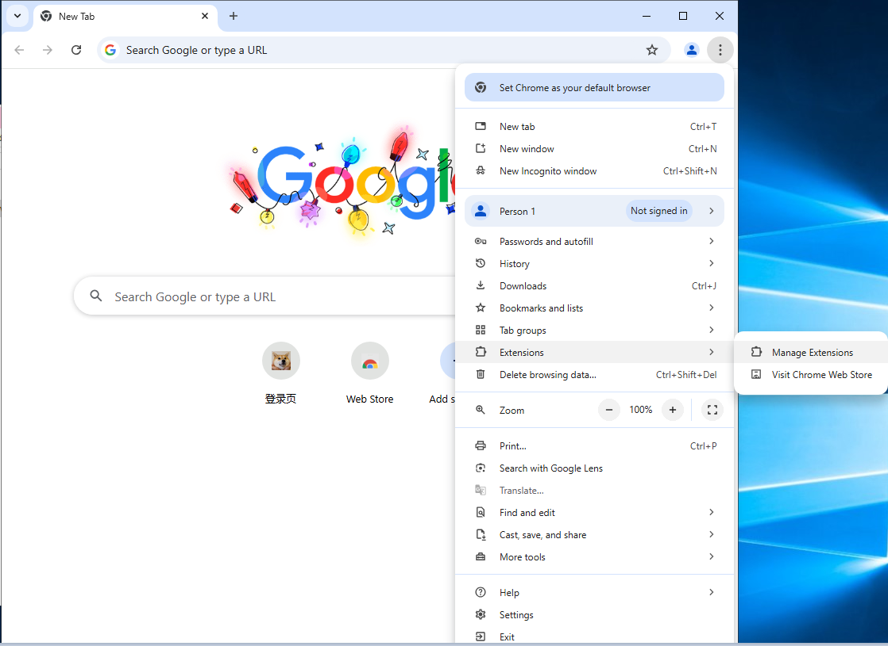
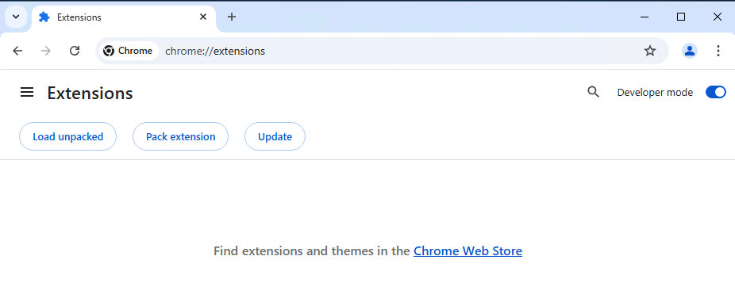
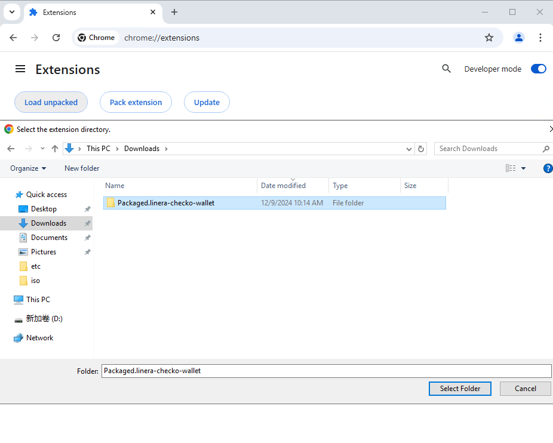
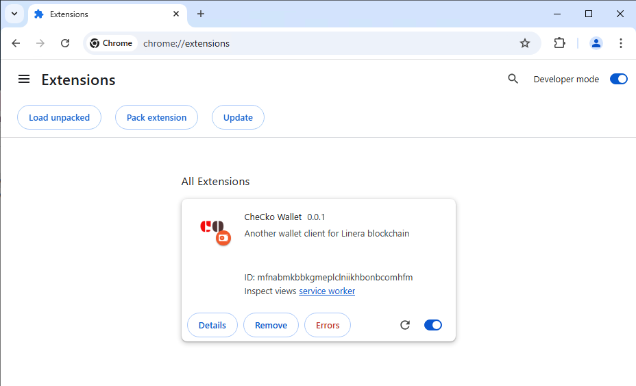
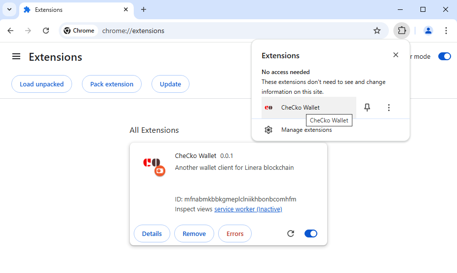

# Installation

Currently we don't publish pre-built package to chrome application store. Users who would like to use CheCko should install it from github repository.

## Install from release zip package

### Download release package from github
```
TBD
```
### Unzip

<center>
<kbd>
  
</kbd>
</center>


### Load release package into chrome extension
<center>

<kbd>
  
</kbd>

<kbd>
  
</kbd>

<kbd>
  
</kbd>

<kbd>
  
</kbd>

<kbd>
  
</kbd>


</center>
```
TBD
```

## Install from source code

### Clone repository
```
git clone https://github.com/respeer-ai/linera-wallet.git
cd linera-wallet
git submodule update --init --recursive
```

### Install rust and wasm toolchain
```
TBD
```

### Compilation
```
yarn
yarn build:wasm
yarn build:bex
```

### Load built package into chrome extension
```
TBD
```
