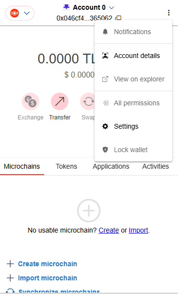
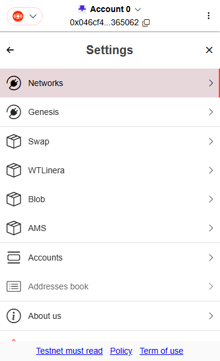
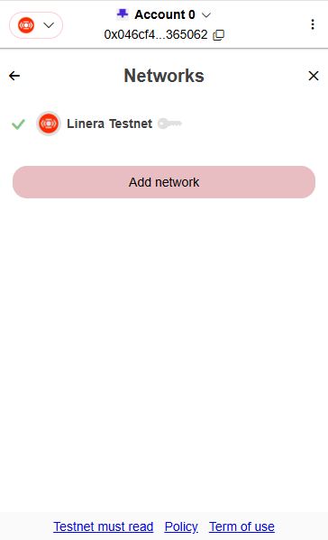
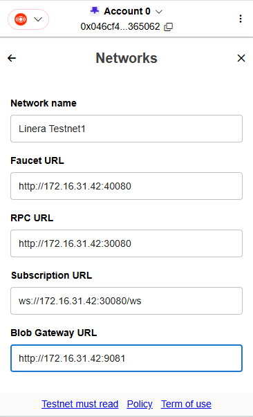
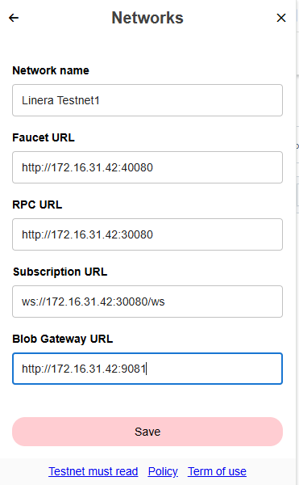
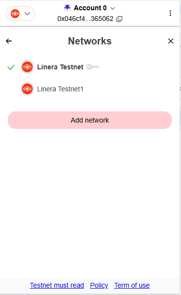

# Set network endpoint

CheCko integrates ResPeer RPC network endpoint in default. Even the RPC endpoint won't hold users' private key, we still encourage user to run their own RPC endpoint to maintain their own chain store. Trust nobody but yourself in the digital world. And, if you really like to use ours or some third party RPC endpoint in future, keep in mind that don't put account with large amount assets into your hot wallet.

### Open network setting menu

<kbd>
  
</kbd>
<kbd>
  
</kbd>
<kbd>
  
</kbd>

TBD

### Fill faucet, rpc and blob gateway endpoint

<kbd>
  
</kbd>

TBD

### Save network setting

<kbd>
  
</kbd>

TBD

### Switch network

<kbd>
  
</kbd>

TBD

**Note**: If you would like to see your microchains in another network, you should import it manually, otherwise you can't process it. That means, each RPC endpoint has its own storage for microchains.
