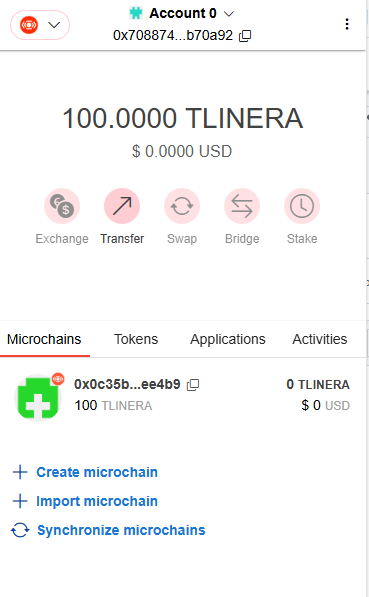
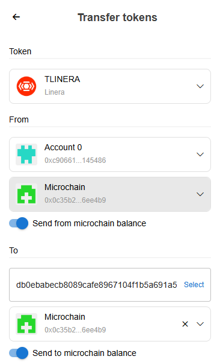
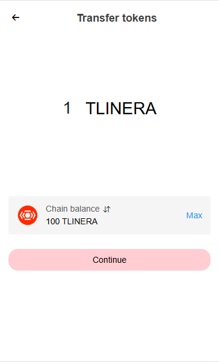
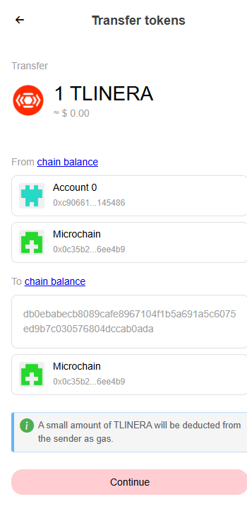
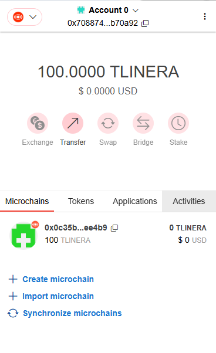
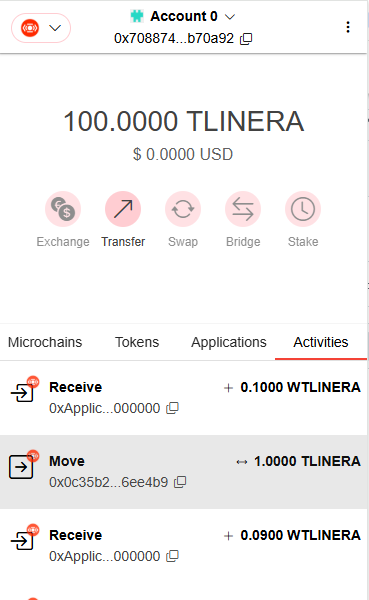
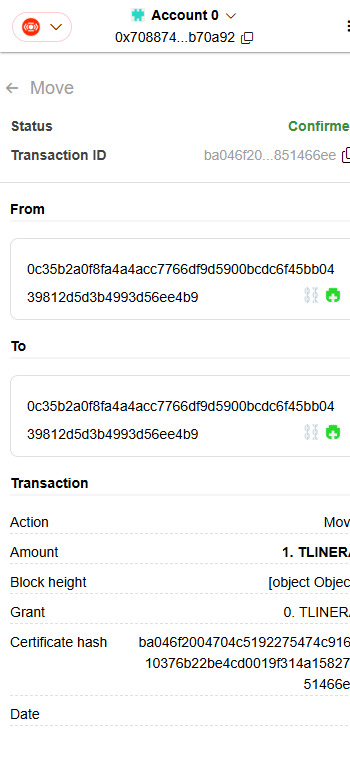

# Transfer native tokens

Different from traditional blockchain, you need to know which chain you need to send. You can send assets to microchain balance or account balance of some microchain.

### Select from and to account / microchain

<kbd>
  
</kbd>

TBD

### Set transfer amount

<kbd>
  
</kbd>

TBD

### Confirm transfer information

<kbd>
  
</kbd>

TBD

### Transfer

<kbd>
  
</kbd>

TBD

### Check transfer detail

<kbd>
  
</kbd>
<kbd>
  
</kbd>
<kbd>
  
</kbd>

TBD
